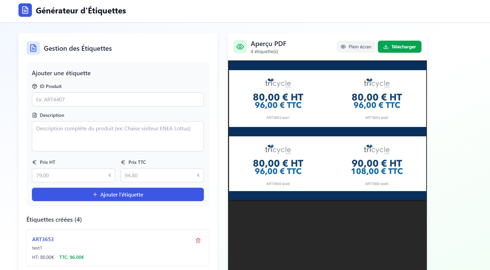

# Générateur d'étiquettes PDF



Ce projet **React** permet de créer, gérer et imprimer des étiquettes produits au format PDF. Il est idéal pour la gestion de stocks, les rayonnages ou l'événementiel.

## ✨ Fonctionnalités

- **Ajout d'étiquettes** : Saisie de l'ID produit, description, prix HT avec calcul automatique du prix TTC.
- **Gestion des doublons** : Notification si un ID produit existe déjà.
- **Suppression d'étiquettes** : Retrait facile d'une étiquette de la liste.
- **Prévisualisation** : Affichage en temps réel des étiquettes créées.
- **Génération PDF** : Téléchargement d’un PDF prêt à imprimer (4 étiquettes par page).
- **Notifications** : Utilisation de pop-ups pour les erreurs et confirmations.

## 🚀 Installation

1. **Cloner le dépôt**
   ```bash
   git clone url-du-repo
   cd project
   npm install
   npm run dev
   
Rendez-vous sur http://localhost:5173 dans votre navigateur.

📁 Structure du projet

src/
├── components/      # Composants React (formulaire, PDF template, etc.)
├── types/           # Types TypeScript pour les produits et étiquettes
├── utils/           # Styles PDF et fonctions utilitaires
public/              # Images (img.png, logos) et fichiers statiques

🛠️ Technologies utilisées
React
TypeScript
Vite
